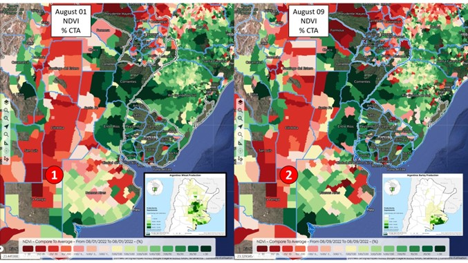
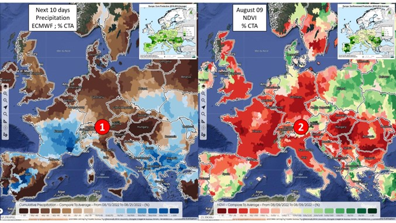
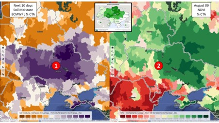

# - August 12, 2022 II Geosys World in 10 Overview Report -

Through daily monitoring on the [Geosys application](https://earthdailyagro.com/), **EarthDaily Agro** keeps a pulse on the world's major crop producing regions. Here is a highlight of the worldwide crop conditions in 10 pictures.

**1. USA -** Will the improvement in the water situation on part of the CornBelt continue in the coming days?

**NO**

In the last 10 years, precipitation 10 to 100% above average was observed in the Central and Eastern CornBelt, while the West remained drier ①. In the coming days, the entire corn zone will be exposed to a dry trend according to the ECMWF ②.

**2. USA -** Are the vegetation indices stable in the CornBelt?

**YES**

Even if we observe here and there some drops in values, the vegetation indices remained mostly stable in the CornBelt between August 01 ① and August 09 ②. However, the water balance is very worrying ③. How much longer will the cultures be able to last? To be continued!

**3. CANADA -** Will the stressful weather conditions for the end of the cycle continue in the coming days?

**YES**

In the coming days, a dry ① and very hot ② trend is anticipated by the European ECMWF model throughout the spring wheat zone.

**4. BRAZIL -** Is the water situation satisfactory in the wheat zone?

**YES**

In the last 10 days, soil moisture was correct in most of the wheat zone, with the exception of part of Parana ①. In the next few days, even this area will experience high humidity values ②, leading to favorable conditions for production potential.

**5. ARGENTINA -** Are the vegetation indices significantly improving in the wheat and barley zone?

**YES**

The comparison of vegetation indices between August 01 ① and August 09 ② highlights a clear improvement in NDVI values in the province of Buenos Aires, the heart of wheat and especially barley production. This is excellent news a few weeks before heading. However, the vegetation indices in the provinces of Cordoba and Santa Fe remain very disappointing. To be continued!

**6. AUSTRALIA -** Are continental vegetation indices improving in the East?

**YES**

The vegetation indices in northern New South Wales and southern Queensland were still very low on August 01 ①, but a few days later on August 09 showed values much closer to average ②. This dynamic is very encouraging for the future.

**7. EUROPE -** Is an improvement in the water situation anticipated for the next few days?

**YES**

Precipitation for the next 10 days is expected above average over parts of France, Italy, Poland, Romania and Bulgaria ①. This is good news for corn grain filler. However, in view of the still catastrophic vegetation indices ②, we remain very pessimistic with regard to the production potential.

**8. RUSSIA -** Did the weather conditions of the last few days allow for rapid ripening of wheat grains?

**YES**

The conditions of the last 10 days in the spring wheat zone, dry ① and hot ② allow a slightly faster end of cycle by accelerating the grain maturation phase. We remain very optimistic for the Russian wheat production potential.

**9. UKRAINE -** Do crop situations seem correct in the maize zone?

**YES**

In a very large part of Ukraine, soil moisture is above average ①, as are vegetation indices ②, thus indicating an absence of water stress for corn and sunflower in Ukraine.

**10. CHINA -** Is the water situation deteriorating in the northeast of the country, the heart of corn and soybean production?

**NO**

Above-average soil moisture in the Northeast for the past 10 days ① will remain satisfactory for the next 10 days ②. This is good news for corn and soybean crops. Note, however, that the center of the country (south of the corn and soybean zone) remains particularly dry. To be continued!

**Want to learn more?**

**Join EarthDaily Agro on** **[LinkedIn](https://www.linkedin.com/company/geosys)**  **or** **[Twitter](https://www.twitter.com/geosys)**  **for more news and insights, or visit us online at** [EarthDailyAgro.com](https://earthdailyagro.com/)

_© 2022 EarthDaily Analytics | All Rights Reserved_
