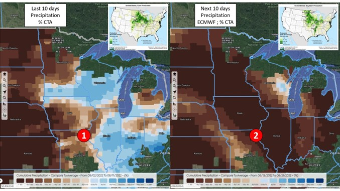
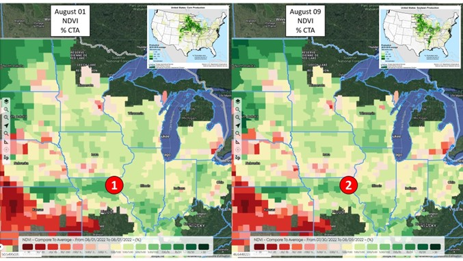
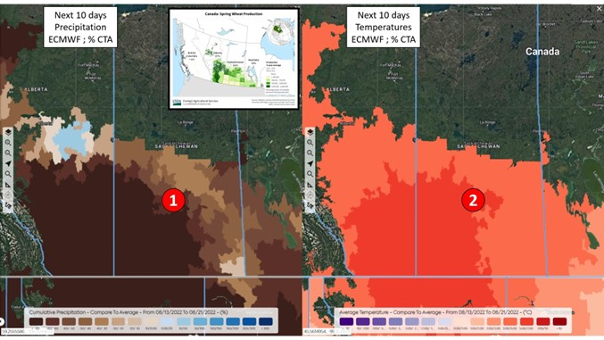
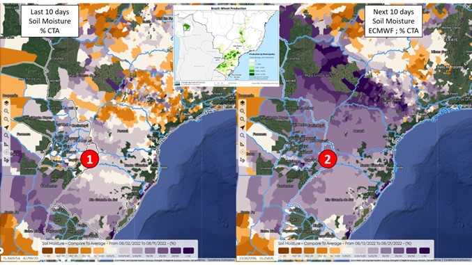
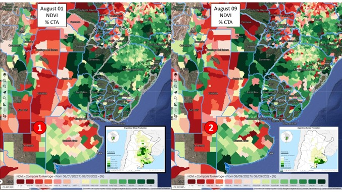
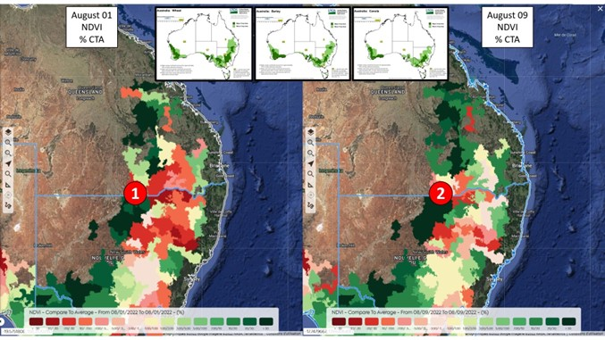
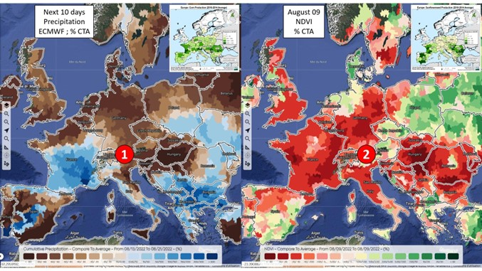
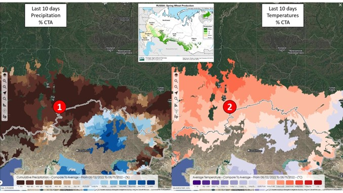
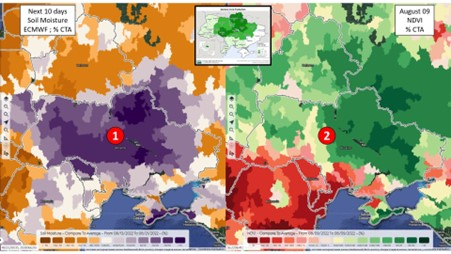
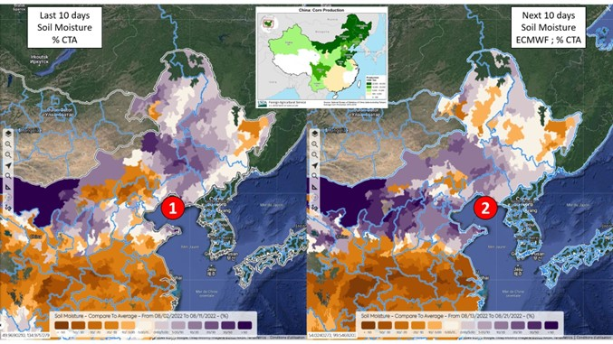

# July 29, 2022 II Geosys World in 10 Overview Report

_Through daily monitoring on the [Geosys application](https://earthdailyagro.com/), **EarthDaily Agro** keeps a pulse on the world's major crop producing regions. Here is a highlight of the worldwide crop conditions in 10 pictures._

## 1. EUROPE -** Is the water situation improving for maize?

**NO**

The very low soil moisture values across the continent in the last 10 days ① will remain extremely worrying in the coming days in the main corn producing countries (with however a more heterogeneous situation in Spain ②.

## 2. EUROPE - Are the corn vegetation indices improving?

**NO**

The vegetation indices, which were much lower than average on July 17 in all the major corn production zones ①, were still catastrophic on July 27 ②.

## 3. UKRAINE - Are the vegetation indices still close to or above average in the maize zone?

**YES**

Soil moistureremains above average in the north of the country, in the heart of the corn zone ①. In this same area, the vegetation indices are at this stage quite correct, close to or above the averages ②.

## 4. RUSSIA - Are the vegetation indices exceptional throughout the spring wheat zone?

**NO**

The vegetation indices, still mostly above average in the spring wheat zone, are disappointing in Siberia ①. In this district, near the border with Kazakhstan, we find NDVI values lower than average and lower than last year ②. Soil moisture will decrease in the next few days, opening up the possibility of an end to the cycle marked by drought ③. To be continued!

## 5. USA - Are the vegetation indices deteriorating in connection with water stress on part of the CornBelt?

**NO**

NDVI values appear stable in the CornBelt between July 17 ① and July 27 ②; still close to or above average in most of the area.

## 6. USA - Should the drought continue in the coming days in the corn zone?

**YES**

Both ECMWF ① and GFS ② models anticipate light precipitation in the coming days over the CornBelt, although the GFS is more optimistic in the East.

## 7. CANADA - Is the water situation improving?

**YES**

In the last 30 days, precipitation has been low in the northern half of the spring wheat zone ①. In the next few days, the rains will be heavy in this same area which has been too dry until now ②.

## 8. ARGENTINA - Is the water situation in the wheat zone improving?

**YES**

Soil moisture, which had hitherto been much lower than average over almost the entire wheat and barley zone ①, is improving, with values which finally exceed the average values in the south of the country ②. We will monitor the evolution of vegetation indices to measure the reaction of wheat and barley to the improvement of the water situation. To be continued!

## 9. AUSTRALIA - Are the vegetation indices in the East still a concern?

**YES**

In northern New South Wales and southern Queensland, vegetation indices remain well below average ①, in line with the poor year 2017 ②.

## 10. INDIA - Are the vegetation indices still illegible in the center of the country?

**YES**

In the South of Madhya Pradesh or in Maharashtra, where a large part of soya and maize is produced, the vegetation indices remain well below average ①. Observation of the NDVI curves highlights a very surprising dynamic because it is much too abrupt at this stage ②. The very heavy rainfall received in the last few days ③ provides information on the problem: the clouds are blocking the reading of the NDVI signal, and it will be necessary to wait to correctly detect the vigor of the crops in the area.

## Want to learn more?

**Join EarthDaily Agro on** **[LinkedIn](https://www.linkedin.com/company/geosys)**  **or** **[Twitter](https://www.twitter.com/geosys)**  **for more news and insights, or visit us online at** [EarthDailyAgro.com](https://earthdailyagro.com/)

_© 2022 EarthDaily Analytics | All Rights Reserved_
